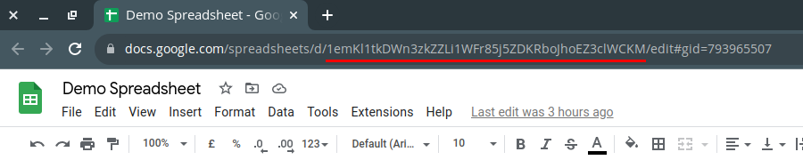
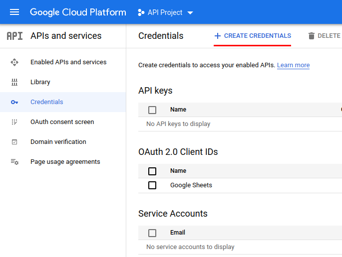
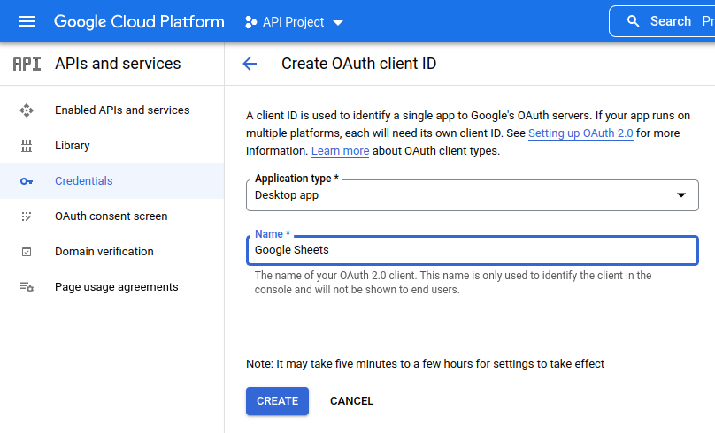
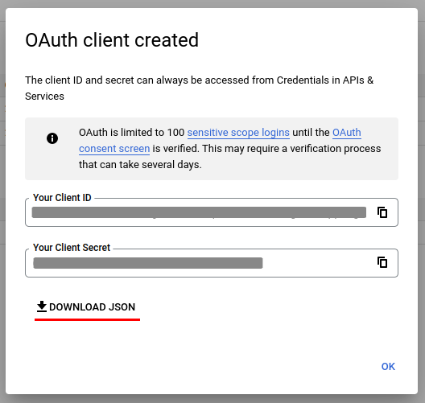
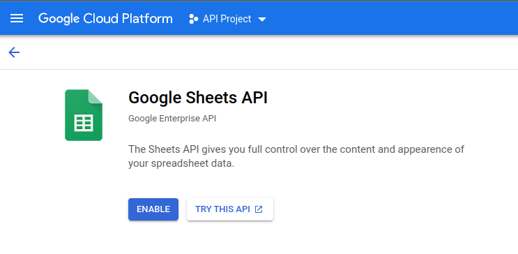

# CSV to Google Sheets

A python script that uploads multiple CSV files into a Google Sheets spreadsheet.

## How does it work?

The script adds a new sheet to an existent Google Sheets spreadsheet with the same name as the CSV file.

- The Google Sheet needs to be created before running the script.
- It will overwrite sheets with the same name.
- It is _not_ possible to append multiple CSV files into a single sheet.

### Usage

```sh
$ python csv_to_sheets.py <folder> <spreadsheetId>
```

The spreadsheet ID may be recovered from the browser URL as shown below.



**Example**
```sh
$ python csv_to_sheets.py '../pathToFolder' '1emKl1tkDWn3zkZZLi1WFr85j5ZDKRboJhoEZ3clWCKM'
```

#### Logging In

If this is the first time running the script, you will need to login with the Google Account which has access to the Google Sheet were the data will be added. The browser may show warnings if your OAuth consent screen hasn't been verified, but you may choose to proceed anyway.

## Prerequisites

- Confirm that you have a supported version of Python. The Google Sheets API requires Python 2 (2.6 or higher).
- The [pip](https://pypi.org/project/pip/) package manager.
- Install Google client library

```
  pip install --upgrade google-api-python-client google-auth-httplib2 google-auth-oauthlib
```

### credentials.json

To be able to connect to Google Sheets, you need to create and download a JSON file containing the OAuth 2 Client credentials. This file should be placed in the root directory of the `csv_to_sheets.py` script.

- If you do not already have a Google Cloud Platform project setup, refer to [Create a project and enable the API](https://developers.google.com/workspace/guides/create-project).
- Once the project is setup, enable the [Google Sheets API](https://console.cloud.google.com/apis/library/sheets.googleapis.com) for that project.
- You then need to create an OAuth 2 Client credentials.



Create OAuth 2 Client credentials by clicking on [Create Credentials](https://console.cloud.google.com/apis/credentials/oauthclient) when on the [Credentials](https://console.cloud.google.com/apis/credentials) page for your project.



Select _Desktop app_ and give it a recognizable name.



If successful, you can download the JSON file containing the credentials. Rename this file to `credentials.json` and place it in the same folder as the script.

_Note that you may need to complete an OAuth Consent screen. If so, you may complete this with the minimum required details. Once completed, you need to publish the OAuth consent screen._

You may find more information on the [Sheets API](https://developers.google.com/sheets/api/quickstart/python).

### FAQ

#### I am receiving a 403 error when running the script

If the 403 message includes "Google Sheets API has not been used in project <PROJECT_ID> before or it is disabled." then you need to enable the [Google Sheets API](https://console.cloud.google.com/apis/library/sheets.googleapis.com) from the Gougle Cloud Platform for that project.



#### I am receiving a HttpError 429

This means that you are exceeding the 'Write requests per minute per user'. You can divide your CSV files into sub-folders and upload them in smaller batches.

#### No such file or directory: 'credentials.json'

Please confirm that you have a `credentials.json` file in the root directory of the script. To generate a `credentials.json` file, please look at the steps described earlier.

#### What is `token.json`?

The file `token.json` stores the user's access and refresh tokens, and is created automatically when the authorization flow completes for the first time.

#### How do I "logout"?

You should delete the `token.json` file.

#### When trying to authenticate, I get the error "'Credentials' object has no attribute 'to_json'"

Use Python2 not Python3. 

## License and Copyright

This software is released under the terms of the [MIT license](https://github.com/kevinfarrugia/csv_to_sheets/blob/main/LICENSE).
